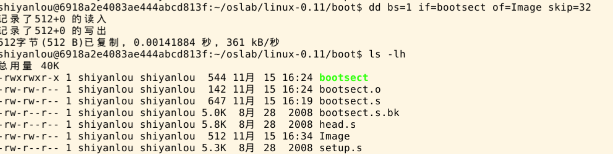
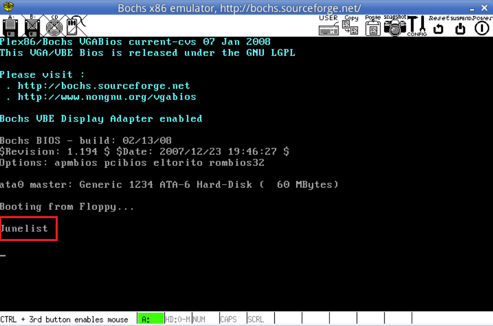
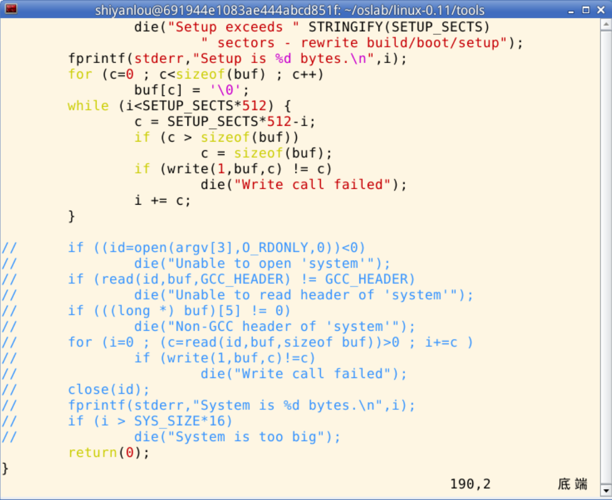
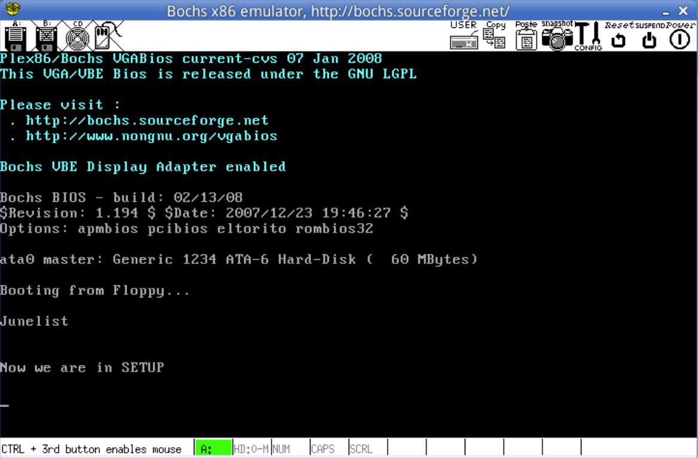
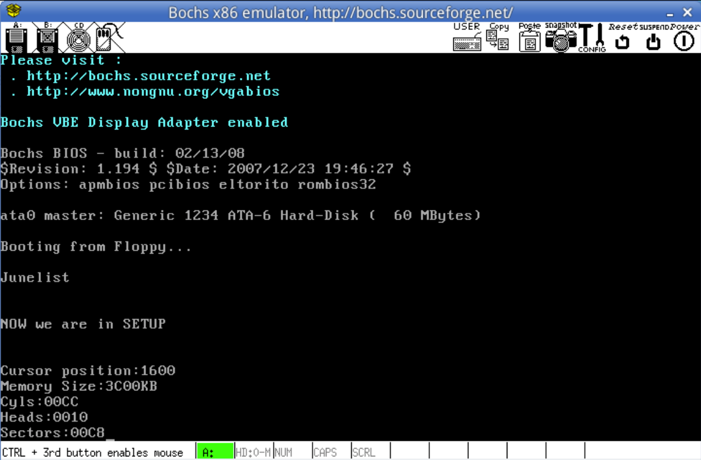
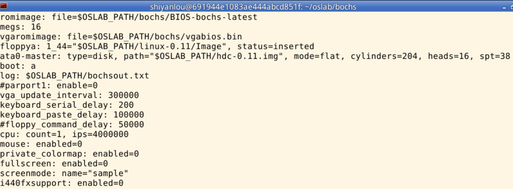

# 实验01：操作系统的引导

## 实验目的

- 熟悉PC机的启动过程和Linux 0.11的引导机制
- 理解操作系统引导程序的工作原理
- 学会获取和显示系统硬件参数

## 实验内容

### 一、改写 bootsect.s
1. 在屏幕上显示自定义操作系统名称的引导信息，设计个性化 logo 或 ASCII 艺术
2. 正确加载 setup.s 到内存指定位置
3. 实现从 bootsect.s 到 setup.s 的跳转

### 二、改写 setup.s
1. 显示进入 setup 的提示信息
2. 获取系统硬件参数（内存大小、显示模式、硬盘参数等）
3. 将获取的参数显示在屏幕上


### 核心知识点

#### 1. 系统加电与 BIOS 初始化
- 计算机加电后，CPU 处于实模式（Real Mode），CS:IP 初始值为 0xF000:0xFFF0，指向 BIOS 固件代码。
- BIOS 首先执行 POST（Power-On Self Test），检测基本硬件（如内存、显卡、磁盘等）是否正常。
- 若 POST 成功，BIOS 根据启动设备顺序（如软盘、硬盘）尝试加载引导程序。

#### 2. 引导扇区（bootsect）加载规范
- BIOS 将启动设备的第 0 磁道第 0 扇区（即bootsect）的 512 字节内容读入物理内存地址 0x07C00。
- 引导扇区必须满足以下条件：
  1. 总长度恰好为 512 字节；
  2. 最后两个字节为魔数（Magic Number）0xAA55（小端序存储为 0x55, 0xAA），否则 BIOS 不认为其为有效引导扇区。
- 加载完成后，BIOS 通过 JMP 0x07C0:0x0000 将控制权交给 bootsect。

#### 3. bootsect 的主要任务
- **自重定位**：bootsect 首先将自身从 0x07C00 移动到更高地址（ 0x90000），为后续加载腾出空间。
- **加载 setup 模块**：
  - setup 通常紧跟在 bootsect 之后，位于第 0 磁道第 2 扇区开始（在 Linux 0.11 中，setup 从扇区 2 开始，共占用最多 4 个扇区）。
  - bootsect 使用INT 0x13中断，将 setup（最多 4×512 = 2048 字节）读入内存 0x90200（紧接在 bootsect 自身之后）。
- **加载 system 模块**：
  - system 是内核主体，通常从第 0 磁道第 6 扇区开始（Linux 0.11 布局：bootsect=1扇区，setup=4扇区，system 从第 6 扇区起）。
  - bootsect 将 system 读入内存 0x10000 起始处，并在屏幕上打印字符串 “Loading system ...”（通过 BIOS INT 0x10实现字符输出）。

#### 4. setup 模块的功能
- setup 最大为 4 个扇区（2048 字节），这是由 bootsect 加载逻辑限定的，超出部分不会被加载。
- setup 运行在实模式下，主要完成：
  - 将收集到的硬件参数（如内存大小、显示模式等）存放在 0x90000 附近内存区域（供后续内核使用）；
  - 关闭中断，设置临时 GDT，开启 A20 地址线；
  - 将 system 从 0x10000 移动到 0x00000（覆盖原中断向量表和 bootsect 区域）；
  - 切换 CPU 到保护模式（Protected Mode）；
  - 跳转到 0x00000 处执行 head.s 编译后的代码。

#### 5.关键 BIOS 中断说明
- INT 0x13: 读取磁盘扇区，用于加载 bootsect/setup/system。
- INT 0x10: 写字符到屏幕，用于打印 “Loading system ...”。
## 实验步骤

### 一、bootsect.s的改写
- 首先，让我们不考虑`bootsect`自身转移以及读取`setup`和`system`等其他作用，而是专注于其在屏幕输出信息，通过查阅`bootsect`源代码:
```nasm
    ! Print some inane message
        mov     ah,#0x03              ! read cursor pos
        xor     bh,bh
        int     0x10

        mov     cx,#24
        mov     bx,#0x0007            ! page 0, attribute 7 (normal)
        mov     bp,#msg1
        mov     ax,#0x1301            ! write string, move cursor
        int     0x10

msg1:
        .byte 13,10
        .ascii "Loading system ..."
        .byte 13,10,13,10

! 这段源码展示了在屏幕输出一段24长度的字符串其中"Loading system ..."字符串一共18字符.byte 13,10则指"\r\t"两个字符。
```
我们就可以仿照这一部分的主要代码通过在最好结束时加一个死循环来保证打印字符的可视性
```nasm
    entry _start
    _start:
        ! 首先读入光标位置
        mov ah,#0x03
        xor bh,bh
        int 0x10

        ! 显示字符串 “Junelist”
        mov cx,#14            ! 要显示的字符串长度
        mov bx,#0x0007
        mov bp,#msg1

        ! es:bp 是显示字符串的地址
        ! 相比与 linux-0.11 中的代码，需要增加对 es 的处理，因为原代码中在输出之前已经处理了 es
        mov ax,#0x07c0
        mov es,ax
        mov ax,#0x1301
        int 0x10

    ! 设置一个无限循环
    inf_loop:
        jmp inf_loop

    
    msg1:
        .byte   13,10
        .ascii  "Junelist"
        .byte   13,10,13,10
    .org 510      !如果前面的代码不足 510 字节，会自动用 0 填充中间的空隙
    boot_flag:
        .word   0xAA55  !魔术字bootsect的结尾两字节必须为0xAA55
```
- `bootsect.s`的编译,在存储`bootsect.s`的文件夹`linux-0.11\boot`下运行如下`bsah`命令：
```bash
    $ as86 -0 -a -o bootsect.o bootsect.s
    $ ld86 -0 -s -o bootsect bootsect.o
```
通过`ls -lh`输出相关参数之后：
可以发现编译成的`bootsect`文件大小为`544KB`大于所需的`512KB`造成多了 32 个字节的原因是 `ld86` 产生的是 `Minix` 可执行文件格式，这样的可执行文件除了文本段、数据段等部分以外，还包括一个 `Minix` 可执行文件头部，它的结构如下：
```C
    struct exec {
    unsigned char a_magic[2];  //执行文件魔数
    unsigned char a_flags;
    unsigned char a_cpu;       //CPU标识号
    unsigned char a_hdrlen;    //头部长度，32字节或48字节
    unsigned char a_unused;
    unsigned short a_version;
    long a_text; long a_data; long a_bss; //代码段长度、数据段长度、堆长度
    long a_entry;    //执行入口地址
    long a_total;    //分配的内存总量
    long a_syms;     //符号表大小
};
```
算一算：6 char（6 字节）+ 1 short（2 字节） + 6 long（24 字节）= 32，正好是 32 个字节，去掉这 32 个字节后就可以放入引导扇区了（这是 `tools/build.c `的用途之一）。
接着使用命令生成名字为Image大小严格为`512KB`的文件：
```bash
    $ dd bs=1 if=bootsect of=Image skip=32
```
- `dd`：Linux/UNIX 下的磁盘/文件复制工具，可按指定块大小、偏移量等精细控制复制过程。
- `bs=1`：设置**块大小（block size）为 1 字节**，即每次读取/写入 1 字节数据（精确控制字节级复制）。
- `if=bootsect`：`if` 是 `input file` 的缩写，指定输入文件为 `bootsect`（通常是编译后的引导扇区二进制文件）。
- `of=Image`：`of` 是 `output file` 的缩写，指定输出文件为 `Image`（最终生成的操作系统镜像文件）。
- `skip=32`：指定从**输入文件（bootsect）的第 32 字节处开始读取**（跳过前 32 字节不复制）。

再将其拷贝到`linux-0.11`目录下并命名为`Image`就可以启动系统了：
```bash
    # 当前的工作路径为 /home/shiyanlou/oslab/linux-0.11/boot/
    #将刚刚生成的 Image 复制到 linux-0.11 目录下
    $ cp ./Image ../Image
    # 执行 oslab 目录中的 run 脚本
    $ ../../run
```

- 艺术字封面，简单的我们只需要再每次打印一行ASCII艺术字的一部分，可以通过汇编设置不同的颜色， ` mov     bx,#0x0007`这段汇编即表示把灰色传给打印出的字符(注意打印`\`需要转义也就是 `\\`)：
```nasm
entry _start
_start:
    ! 首先读入光标位置
    mov ah,#0x03
    xor bh,bh
    int 0x10

    ! 设置es为0x07c0
    mov ax,#0x07c0
    mov es,ax

    ! 显示第一行艺术字（白色）
    mov cx,#53            ! 字符串长度
    mov bx,#0x0007        ! 白色文字，黑色背景
    mov bp,#art_line1
    mov ax,#0x1301
    int 0x10

    ! 首先读入光标位置
    mov ah,#0x03
    xor bh,bh
    int 0x10

    ! 显示第二行艺术字（青色）
    mov cx,#53
    mov bx,#0x0003        ! 青色文字
    mov bp,#art_line2
    mov ax,#0x1301
    int 0x10

    ! 首先读入光标位置
    mov ah,#0x03
    xor bh,bh
    int 0x10

    ! 显示第三行艺术字（紫色）
    mov cx,#53
    mov bx,#0x0005        ! 紫色文字
    mov bp,#art_line3
    mov ax,#0x1301
    int 0x10

    ! 首先读入光标位置
    mov ah,#0x03
    xor bh,bh
    int 0x10

    ! 显示第四行艺术字（棕色）
    mov cx,#53
    mov bx,#0x0006        ! 棕色文字
    mov bp,#art_line4
    mov ax,#0x1301
    int 0x10

    ! 首先读入光标位置
    mov ah,#0x03
    xor bh,bh
    int 0x10
    
    ! 显示第五行艺术字（灰色）
    mov cx,#55
    mov bx,#0x0008        ! 灰色文字
    mov bp,#art_line5
    mov ax,#0x1301
    int 0x10

! 设置一个无限循环
inf_loop:
    jmp inf_loop

! ASCII艺术字 - 紧凑排列
art_line1:
    .ascii  "      _                          _   _         _   "
    .byte 13, 10
art_line2:
    .ascii  "     | |  _   _   _ __     ___  | | (_)  ___  | |_ "
    .byte 13, 10
art_line3:
    .ascii  "  _  | | | | | | | '_ \\   / _ \\ | | | | / __| | __|"
    .byte 13, 10
art_line4:
    .ascii  " | |_| | | |_| | | | | | |  __/ | | | | \\__ \\ | |_ "
    .byte 13, 10
art_line5:
    .ascii  "  \\___/   \\__,_| |_| |_|  \\___| |_| |_| |___/  \\__|"
    .byte 13, 10, 13, 10

.org 510
boot_flag:
    .word   0xAA55
```


### 二、setup.s的改写
- 首先，让我们实现当进入`setup`就打印`"Now we are in SETUP"`这很简单，我们只需要把先打印`Junelist`的`bootsect`代码稍微修改一下就可以：
```nasm
    entry _start
    _start:
        ! 首先读入光标位置
        mov ah,#0x03
        xor bh,bh
        int 0x10

        ! 显示字符串 “Now we are in SETUP”
        mov cx,#25            
        mov bx,#0x0007
        mov bp,#msg2

        !在这里我们要修改es的值，由于es:bp是字符串的地址bp已经正确的写入，我们可以用指向此代码段的cs来赋值给es
        mov ax,cs
        mov es,ax
        mov ax,#0x1301
        int 0x10

    ! 设置一个无限循环
    inf_loop:
        jmp inf_loop

    
    msg2:
        .byte   13,10
        .ascii  "Now we are in SETUP"
        .byte   13,10,13,10
```
- 接着我们修改`bootsect`让其能读取`setup`,让我们看一下原来`bootsect`的源代码：
```nasm
SETUPLEN = 4    !要读取的扇区数
SETUPSEG = 0x9020   !目标内存段地址

load_setup:
    mov     dx,#0x0000  !DH=0, DL=0
    mov     cx,#0x0002  !CH=0, CL=2              
    mov     bx,#0x0200  !大小512KB           
    mov     ax,#0x0200+SETUPLEN !4个扇区     
    int     0x13    !读中断                    
    jnc     ok_load_setup  !读成功处理
    mov     dx,#0x0000  !重置磁盘参数
    mov     ax,#0x0000  !磁盘复位功能              
    int     0x13        !调用磁盘复位
    j       load_setup  !重新尝试读取
```
那么我们就可以修改`bootsect`:
```nasm
SETUPLEN=2
SETUPSEG=0x07e0

entry _start
    _start:
        ! 首先读入光标位置
        mov ah,#0x03
        xor bh,bh
        int 0x10

        ! 显示字符串 “Junelist”
        mov cx,#14            ! 要显示的字符串长度
        mov bx,#0x0007
        mov bp,#msg1

        ! es:bp 是显示字符串的地址
        ! 相比与 linux-0.11 中的代码，需要增加对 es 的处理，因为原代码中在输出之前已经处理了 es
        mov ax,#0x07c0
        mov es,ax
        mov ax,#0x1301
        int 0x10

    load_setup:
    ! 设置驱动器和磁头(drive 0, head 0): 软盘 0 磁头
        mov dx,#0x0000
    ! 设置扇区号和磁道(sector 2, track 0): 0 磁头、0 磁道、2 扇区
        mov cx,#0x0002
    ! 设置读入的内存地址：BOOTSEG+address = 512，偏移512字节
        mov bx,#0x0200
    ! 设置读入的扇区个数(service 2, nr of sectors)，
    ! SETUPLEN是读入的扇区个数，Linux 0.11 设置的是 4，
    ! 我们不需要那么多，我们设置为 2（因此还需要添加变量 SETUPLEN=2）
        mov ax,#0x0200+SETUPLEN
    ! 应用 0x13 号 BIOS 中断读入 2 个 setup.s扇区
        int 0x13
    ! 读入成功，跳转到 ok_load_setup: ok - continue
        jnc ok_load_setup
    ! 软驱、软盘有问题才会执行到这里
        mov dx,#0x0000
    ! 否则复位软驱 reset the diskette
        mov ax,#0x0000
        int 0x13
    ! 重新循环，再次尝试读取
        jmp load_setup
    ok_load_setup:
    ! 接下来要干什么？当然是跳到 setup 执行。
    ! 要注意：我们没有将 bootsect 移到 0x9000，因此跳转后的段地址应该是 0x7ce0
    ! 即我们要设置 SETUPSEG=0x07e0
    jmpi    0,SETUPSEG
    
    msg1:
        .byte   13,10
        .ascii  "Junelist"
        .byte   13,10,13,10
    .org 510      !如果前面的代码不足 510 字节，会自动用 0 填充中间的空隙
    boot_flag:
        .word   0xAA55  !魔术字bootsect的结尾两字节必须为0xAA55
```
- 修改`tools/build.c `如果我们直接在 `linux-0.11`目录下运行`$ make BootImage`便会报错，因为make 根据 Makefile 的指引执行了 tools/build.c，它是为生成整个内核的镜像文件而设计的，没考虑我们只需要 bootsect.s 和 setup.s 的情况。它在向我们要 “系统” 的核心代码，为了完成实验问哦们需要对其修改。 `build.c` 从命令行参数得到 `bootsect`、`setup` 和 `system` 内核的文件名，将三者做简单的整理后一起写入 `Image`。其中 `system` 是第三个参数（`argv[3]`）。当 `make all`的时候，这个参数传过来的是正确的文件名，`build.c` 会打开它，将内容写入 `Image`。而 `make BootImage` 时，传过来的是字符串 `none`。所以，改造 `build.c` 的思路就是当 `argv[3]` 是`none`的时候，只写 `bootsect` 和 `setup`，忽略所有与 `system` 有关的工作，或者在该写 `system` 的位置都写上 `0`。

当我们再重新运行`make BootImage`和`./run`式就会看到


### 三、setup.s 获取基本硬件参数
- `setup.s`将获得硬件参数放在内存的 `0x90000` 处。原版 `setup.s` 中已经完成了光标位置、内存大小、显存大小、显卡参数、第一和第二硬盘参数的保存。用 `ah=#0x03` 调用 `0x10` 中断可以读出光标的位置，用 `ah=#0x88` 调用 `0x15` 中断可以读出内存的大小。有些硬件参数的获取要稍微复杂一些，如磁盘参数表。在 `PC` 机中 `BIOS` 设定的中断向量表中 `int 0x41` 的中断向量位置`(4*0x41 = 0x0000:0x0104)`存放的并不是中断程序的地址，而是第一个硬盘的基本参数表。第二个硬盘的基本参数表入口地址存于 `int 0x46` 中断向量位置处。每个硬盘参数表有 `16` 个字节大小。下表给出了硬盘基本参数表的内容：

    | 位移 | 大小 | 说明         |
    | ---- | ---- | ------------ |
    | 0x00 | 字   | 柱面数       |
    | 0x02 | 字节 | 磁头数       |
    | 0x0E | 字节 | 每磁道扇区数 |
    | 0x0F | 字节 | 保留         |
所以获得磁盘参数的方法就是复制数据。下面是将硬件参数取出来放在内存 `0x90000`的关键代码。
```nasm
    mov    ax,#INITSEG
    ! 设置 ds = 0x9000
    mov    ds,ax
    mov    ah,#0x03
    ! 读入光标位置
    xor    bh,bh
    ! 调用 0x10 中断
    int    0x10
    ! 将光标位置写入 0x90000.
    mov    [0],dx

    ! 读入内存大小位置
    mov    ah,#0x88
    int    0x15
    mov    [2],ax

    ! 从 0x41 处拷贝 16 个字节（磁盘参数表）
    mov    ax,#0x0000
    mov    ds,ax
    lds    si,[4*0x41]
    mov    ax,#INITSEG
    mov    es,ax
    mov    di,#0x0004
    mov    cx,#0x10
    ! 重复16次
    rep
    movsb
```

- 现在已经将硬件参数取出来放在了 `0x90000` 处，接下来的工作是将这些参数显示在屏幕上。这些参数都是一些无符号整数，所以需要做的主要工作是用汇编程序在屏幕上将这些整数显示出来。以十六进制方式显示比较简单。这是因为十六进制与二进制有很好的对应关系，显示时只需将原二进制数每四位划成一组，按组求对应的 `ASCII` 码送显示器即可。`ASCII` 码与十六进制数字的对应关系为：`0x30 ～ 0x39` 对应数字 `0 ～ 9`，`0x41 ～ 0x46` 对应数字 `a ～ f`。从数字 `9` 到 `a`，其 `ASCII` 码间隔了 `7h`，这一点在转换时要特别注意。为使一个十六进制数能按高位到低位依次显示，实际编程中，需对 bx 中的数每次循环左移一组，然后屏蔽掉当前高 `12` 位，对当前余下的 `4` 位求其 `ASCII` 码，要判断它是 `0 ～ 9` 还是 `a ～ f`，是前者则加 `0x30` 得对应的 `ASCII` 码，后者则要加 `0x37` 才行，最后送显示器输出。以上步骤重复四次，就可以完成 `bx` 中数以四位十六进制的形式显示出来。下面是完成显示十六进制数的汇编语言程序的关键代码，其中用到的 `BIOS` 中断为 `INT 0x10`，功能号 `0x0E`（显示一个字符），即 `AH=0x0E`，`AL=要显示字符的 ASCII 码`。
```nasm
    ! 以 16 进制方式打印栈顶的16位数
    print_hex:
    ! 4 个十六进制数字,一共两个字节
        mov cx,#4
    ! 将(bp)所指的值放入 dx 中，如果 bp 是指向栈顶的话
        mov dx,(bp)
    print_digit:
    ! 循环以使低 4 比特用上 !! 取 dx 的高 4 比特移到低 4 比特处。
        rol dx,#4
    ! ah = 请求的功能值，al = 半字节(4 个比特)掩码。
        mov ax,#0xe0f
    ! 取 dl 的低 4 比特值。
        and al,dl
    ! 给 al 数字加上十六进制 0x30
        add al,#0x30
        cmp al,#0x3a
    ! 是一个不大于十的数字
        jl  outp
    ! 是a～f，要多加 7
        add al,#0x07
    outp:
        int 0x10
        loop    print_digit
        ret
    ! 这里用到了一个 loop 指令;
    ! 每次执行 loop 指令，cx 减 1，然后判断 cx 是否等于 0。
    ! 如果不为 0 则转移到 loop 指令后的标号处，实现循环；
    ! 如果为0顺序执行。
    !
    ! 另外还有一个非常相似的指令：rep 指令，
    ! 每次执行 rep 指令，cx 减 1，然后判断 cx 是否等于 0。
    ！ 如果不为 0 则继续执行 rep 指令后的串操作指令，直到 cx 为 0，实现重复。

    ! 打印回车换行
    print_nl:
    ! CR
        mov ax,#0xe0d
        int 0x10
    ! LF
        mov al,#0xa
        int 0x10
        ret
```
只要在适当的位置调用 print_bx 和 print_nl（注意，一定要设置好栈，才能进行函数调用）就能将获得硬件参数打印到屏幕上。下面是提供的参考代码，可以根据这个来进行编写代码：
```nasm
    INITSEG  = 0x9000
    entry _start
    _start:
    ! Print "NOW we are in SETUP"
        mov ah,#0x03
        xor bh,bh
        int 0x10
        mov cx,#25
        mov bx,#0x0007
        mov bp,#msg2
        mov ax,cs
        mov es,ax
        mov ax,#0x1301
        int 0x10

        mov ax,cs
        mov es,ax
    ! init ss:sp
        mov ax,#INITSEG
        mov ss,ax
        mov sp,#0xFF00

    ! Get Params
        mov ax,#INITSEG
        mov ds,ax
        mov ah,#0x03
        xor bh,bh
        int 0x10
        mov [0],dx
        mov ah,#0x88
        int 0x15
        mov [2],ax
        mov ax,#0x0000
        mov ds,ax
        lds si,[4*0x41]
        mov ax,#INITSEG
        mov es,ax
        mov di,#0x0004
        mov cx,#0x10
        rep
        movsb

    ! Be Ready to Print
        mov ax,cs
        mov es,ax
        mov ax,#INITSEG
        mov ds,ax

    ! Cursor Position
        mov ah,#0x03
        xor bh,bh
        int 0x10
        mov cx,#18
        mov bx,#0x0007
        mov bp,#msg_cursor
        mov ax,#0x1301
        int 0x10
        mov dx,[0]
        call    print_hex
    ! Memory Size
        mov ah,#0x03
        xor bh,bh
        int 0x10
        mov cx,#14
        mov bx,#0x0007
        mov bp,#msg_memory
        mov ax,#0x1301
        int 0x10
        mov dx,[2]
        call    print_hex
    ! Add KB
        mov ah,#0x03
        xor bh,bh
        int 0x10
        mov cx,#2
        mov bx,#0x0007
        mov bp,#msg_kb
        mov ax,#0x1301
        int 0x10
    ! Cyles
        mov ah,#0x03
        xor bh,bh
        int 0x10
        mov cx,#7
        mov bx,#0x0007
        mov bp,#msg_cyles
        mov ax,#0x1301
        int 0x10
        mov dx,[4]
        call    print_hex
    ! Heads
        mov ah,#0x03
        xor bh,bh
        int 0x10
        mov cx,#8
        mov bx,#0x0007
        mov bp,#msg_heads
        mov ax,#0x1301
        int 0x10
        mov dx,[6]
        call    print_hex
    ! Secotrs
        mov ah,#0x03
        xor bh,bh
        int 0x10
        mov cx,#10
        mov bx,#0x0007
        mov bp,#msg_sectors
        mov ax,#0x1301
        int 0x10
        mov dx,[12]
        call    print_hex

    inf_loop:
        jmp inf_loop

    print_hex:
        mov    cx,#4
    print_digit:
        rol    dx,#4
        mov    ax,#0xe0f
        and    al,dl
        add    al,#0x30
        cmp    al,#0x3a
        jl     outp
        add    al,#0x07
    outp:
        int    0x10
        loop   print_digit
        ret
    print_nl:
        mov    ax,#0xe0d     ! CR
        int    0x10
        mov    al,#0xa     ! LF
        int    0x10
        ret

    msg2:
        .byte 13,10
        .ascii "NOW we are in SETUP"
        .byte 13,10,13,10
    msg_cursor:
        .byte 13,10
        .ascii "Cursor position:"
    msg_memory:
        .byte 13,10
        .ascii "Memory Size:"
    msg_cyles:
        .byte 13,10
        .ascii "Cyls:"
    msg_heads:
        .byte 13,10
        .ascii "Heads:"
    msg_sectors:
        .byte 13,10
        .ascii "Sectors:"
    msg_kb:
        .ascii "KB"

    .org 510
    boot_flag:
        .word 0xAA55
```

线上的环境中参数可能跟上面给出的不一致。大家需要根据自己环境中 `bochs/bochsrc.bxrc` 文件中的内容才能确定具体的输出信息。
