# 实验03: 进程运行轨迹的跟踪与统计

## 实验目的

- 理解进程生命周期中状态转换（创建、就绪、运行、阻塞、退出）在内核代码中的具体实现。
- 掌握通过内核插桩和日志记录来跟踪与分析操作系统运行时行为的基本方法。
- 熟悉基于进程运行轨迹计算周转时间、等待时间等关键性能指标的数据处理流程。

## 实验内容

- 基于模板 `process.c` 编写多进程的样本程序，实现如下功能：1.所有子进程都并行运行，每个子进程的实际运行时间一般不超过 30 秒；2.父进程向标准输出打印所有子进程的 id，并在所有子进程都退出后才退出；
- 在 `Linux0.11` 上实现进程运行轨迹的跟踪。基本任务是在内核中维护一个日志文件 `/var/process.log`，把从操作系统启动到系统关机过程中所有进程的运行轨迹都记录在这一 `log` 文件中。
- 在修改过的 0.11 上运行样本程序，通过分析 log 文件，统计该程序建立的所有进程的等待时间、完成时间（周转时间）和运行时间，然后计算平均等待时间，平均完成时间和吞吐量。可以自己编写统计程序，也可以使用 `python` 脚本程序—— `stat_log.py`（在 `/home/teacher/` 目录下） ——进行统计。
- 修改 0.11 进程调度的时间片，然后再运行同样的样本程序，统计同样的时间数据，和原有的情况对比，体会不同时间片带来的差异。

`/var/process.log` 文件的格式必须为：
```
pid    X    time
```
其中：

- pid 是进程的 ID；
- X 可以是 N、J、R、W 和 E 中的任意一个，分别表示进程新建(N)、进入就绪态(J)、进入运行态(R)、进入阻塞态(W) 和退出(E)；
- time 表示 X 发生的时间。这个时间不是物理时间，而是系统的滴答时间(tick)；
- 三个字段之间用制表符分隔。

### 进程的核心知识点

#### 1. CPU 的基本工作模式
- **取指-执行循环（Fetch-Execute Cycle）**：
  - 控制器从内存中读取指令（由 PC 指针指定地址）
  - 译码并执行
  - PC 自动递增，继续下一条指令
  
  这是冯·诺依曼体系结构的核心机制。

#### 2. 单程序执行的瓶颈
- 当程序执行 I/O 操作（如磁盘读写、键盘输入）时，**CPU 必须等待 I/O 完成**。
- **速度不匹配问题**：
  - CPU 执行一条指令 ≈ 纳秒级（10⁻⁹ s）
  - 机械 I/O（如硬盘） ≈ 毫秒级（10⁻³ s）
  - **比例约为 10⁶ : 1** → 执行一次 I/O 的时间可执行百万条 CPU 指令！
- 结果：**CPU 利用率极低**（可能接近 0%），资源严重浪费。

#### 3. 并发思想的诞生
- **核心目标**：不让 CPU 闲着！
- **解决方案**：在多个程序之间**交替执行**（Concurrency）。
  - 当进程 A 等待 I/O 时，切换到进程 B 执行；
  - I/O 完成后，再切回 A。
- 这种机制称为 **多道程序设计（Multiprogramming）**，是现代操作系统的基石。

#### 4. 什么是“多进程图像”？
- 从开机到关机，操作系统始终维持一个**多个进程交替推进的动态画面**。
- 对用户：任务管理器中看到多个进程运行；
- 对 OS：维护一组 PCB，通过调度算法决定谁使用 CPU。

#### 5. 进程的本质
- **程序（Program）**：静态的代码和数据（存储在磁盘）。
- **进程（Process）**：**运行中的程序**，包含：
  - 当前执行位置（PC）
  - 寄存器状态
  - 内存映射
  - 打开的文件、信号处理方式等
- **关键抽象**：**PCB（Process Control Block）**
  - 每个进程对应一个 PCB
  - PCB 是 OS 管理进程的“身份证”

#### 6. 多进程的组织结构
- **PCB 队列 + 状态机模型**
  - 常见状态：
    - **就绪（Ready）**：可运行，等待 CPU
    - **运行（Running）**：正在使用 CPU
    - **等待（Waiting/Blocked）**：等待 I/O 或事件
  - 状态转换由 OS 控制：
    ```c
    // 示例：进程发起磁盘读
    pCur->state = 'W';                 // 运行 → 等待
    enqueue(DiskWaitQueue, pCur);     // 加入等待队列
    schedule();                       // 触发调度
    ```

#### 7. 进程切换机制（Context Switch）
- **核心函数**：
  ```c
  schedule() {
      pNew = getNext(ReadyQueue);    // 从就绪队列选下一个进程
      switch_to(pCur, pNew);         // 切换上下文
  }
  ```
`switch_to()` 函数功能
- 保存当前进程（pCur）的 CPU 上下文（寄存器、PC、栈指针等）到其 PCB
- 从新进程（pNew）的 PCB 中恢复上下文到 CPU
- 实现依赖汇编（因需精细控制寄存器）
- 注：Linux 0.11 中 PCB 是 task_struct 数组，调度采用 counter 时间片轮转。

#### 8. 多进程带来的两大挑战

##### （1）地址空间隔离（Memory Isolation）
- **问题**：若进程 A 能直接修改进程 B 的内存 → 系统崩溃或安全漏洞。
- **解决方案**：
  - 每个进程拥有独立的虚拟地址空间
  - 通过 页表（Page Table） + MMU 实现虚拟地址 → 物理地址映射
  - 进程切换时，同时切换页表基址寄存器（如 CR3）
  - 这也是内存管理为多进程服务的体现。

##### （2）进程合作与同步（Synchronization）
- **问题**：多个进程访问共享资源（如打印缓冲区）时，若无协调，会导致竞态条件（Race Condition）。
  - 例：生产者-消费者问题中，两个进程同时写入同一缓冲区 → 数据混乱。
- **解决方案**：
  - 临界区保护：同一时间只允许一个进程进入
  - 互斥锁（Mutex）、信号量（Semaphore） 等同步原语
  - 后续课程深入讲解（如 PV 操作）
  
### 实验前的额外知识

#### 1.系统调用times

times系统调用接受一个`struct tms*`类型的参数，该结构体用于保存进程和其子进程的 CPU 时间信息，同时 times 系统调用会返回一个滴答数，即时钟周期数，该滴答数表示自OS启动以来经过的时钟周期数。 `struct tms`类型在`include/sys/times.h`中定义如下：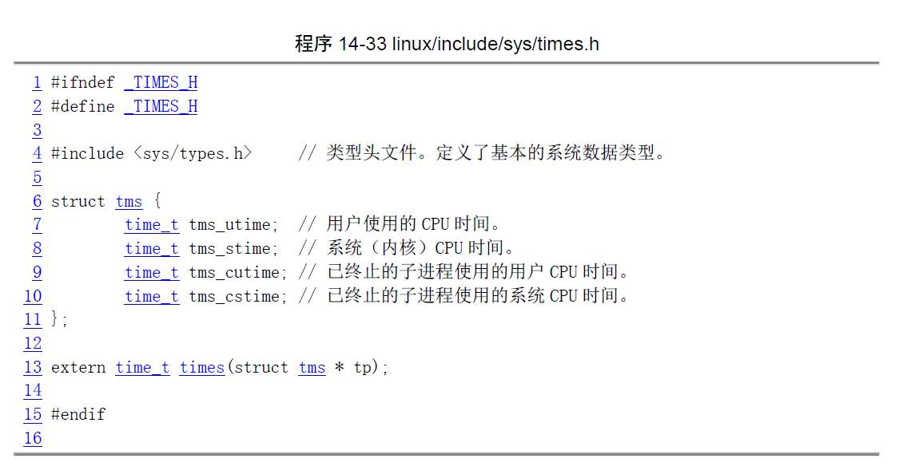其中在`time_t`的定义在`include/sys/types.h`：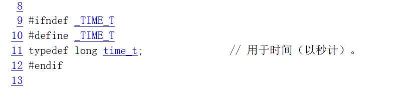这里我们要弄明白一件事，*long* 并非 *long long* 在 C/C++ 中，*long* 是一个基础数据类型修饰符，用来表示 “长整型”，它的具体大小由编译器和操作系统决定（通常在 32 位系统中是 4 字节，64 位系统中可能是 4 或 8 字节）。而 *long long* 是 C99 标准新增的 “更长的长整型”，固定至少 8 字节（可表示更大的整数范围）。

`tms_stime`和`tms_utime`分别记录了进程在内核态和用户态下消耗的CPU时间总和，它们的和就是进程从开始执行到调用times系统调用所经过的时间。`tms_stime`和`tms_utime`并不包括进程在睡眠状态或等待I/O操作中所消耗的时间，因此它们的和也不等于进程的实际运行时间。 注意这里时间的单位是CPU的滴答时间（tick），一个滴答数表示两个时钟中断的间隔。在Linux系统中，时钟中断通常由硬件定时器产生，定时器会以固定的频率向CPU发送中断信号。每当时钟中断发生时，内核会将当前进程的时间片计数器减 1，内核会检查当前进程的时间片（counter）是否已经用完，如果用完了，就将当前进程放到就绪队列中，然后调用调度函数 schedule 选择一个新的进程运行。这个频率通常是100Hz，即一秒发生100次，也就是说时间中断的间隔为10ms（1/100s），每隔10ms就发生一次时钟中断，linux内核中的`jiffies`变量就记录了时间中断的个数，即滴答数。`jiffies` 在 `kernel/sched.c` 文件中定义为一个全局变量：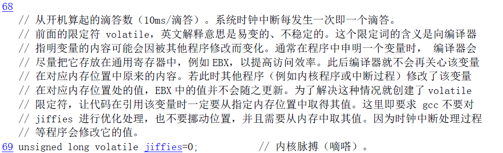它记录了从开机到当前时间的时钟中断发生次数。在 `kernel/sched.c` 文件中的 `sched_init()` 函数中，时钟中断处理函数被设置为：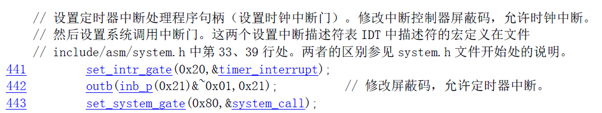而在 `kernel/system_call.s` 文件中将 `timer_interrupt` 定义为：
```c
timer_interrupt:
!    ……
! 增加jiffies计数值
    incl jiffies
!    ……
```
这说明 `jiffies` 表示从开机时到现在发生的时钟中断次数，这个数也被称为 “滴答数”。

#### 2. 系统调用wait

`wait` 函数是一个系统调用（位于`include/sys/wait.h`）。在`Unix/Linux`操作系统中，`wait`函数可以等待子进程结束，并获取子进程的退出状态。在使用`wait`函数时，如果子进程已经结束，`wait`函数会立即返回并返回子进程的退出状态；如果子进程还没有结束，`wait`函数会阻塞父进程，直到子进程结束并返回其退出状态。具体来说，`wait` 函数的作用如下： 1.如果当前进程没有子进程，`wait` 函数会立即返回 -1，并设置 `errno` 为 `ECHILD`，表示当前进程没有子进程需要等待。 2.如果当前进程有一个或多个子进程正在运行，调用 `wait` 函数会阻塞当前进程，直到其中一个子进程结束。当子进程结束时，`wait`函数会返回该子进程的进程 `ID`，并将该子进程的退出状态保存到一个整型变量`status`中。 3.如果当前进程有多个子进程正在运行，调用`wait`函数会等待其中任意一个子进程结束，并且无法指定要等待哪个子进程。如果需要等待特定的子进程，可以使用 `waitpid`函数代替`wait`函数。 需要注意的是，如果当前进程没有调用`wait`函数等待其子进程结束，那么当子进程结束时，其退出状态可能会一直保存在内核中，直到当前进程调用wait或`waitpid`函数获取该状态。如果当前进程没有获取子进程的退出状态，那么该子进程就会成为僵尸进程（Zombie Process），占用系统资源并且无法被正常清理。 因此，在编写多进程程序时，通常需要在父进程中调用`wait`或`waitpid`函数等待子进程结束，并获取其退出状态，以避免产生僵尸进程。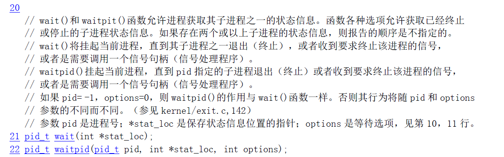对linux0.11 `wait`函数必须接受一个`int`参数以保存子进程退出状态，如果你不想保存该信息，可传递`NULL`。而在现代`linux`中，该参数为可选参数。

#### 3.linux0.11中进程的state值

在Linux 0.11中，进程状态可以被表示为以下几个值：

- `TASK_RUNNING`：进程正在执行，也就是说CPU正在执行它的指令。但是，如果一个进程的状态为`TASK_RUNNING`，而它又没有占用CPU时间片运行，那么它就是处于就绪态。
- `TASK_INTERRUPTIBLE`：进程正在等待某个事件的发生（例如，等待用户输入、等待网络数据等），它已经睡眠，并且可以响应一个信号以退出等待状态。
- `TASK_UNINTERRUPTIBLE`：和`TASK_INTERRUPTIBLE`一样，进程也是正在等待某个事件的发生，但是进程在等待期间不会响应信号，直到事件发生后才会退出等待状态，比如I/O操作。
- `TASK_STOPPED`：进程已经被停止，通常是收到了一个`SIGSTOP`信号。
- `TASK_ZOMBIE`: 进程已终止执行，但其父进程尚未调用 `wait()` 或 `waitpid()` 来获取其退出状态。此时进程占用的资源（除进程控制块 PCB 外）已被释放，但其 PCB 仍保留，直到父进程回收。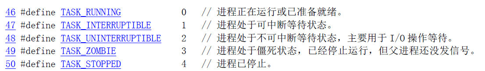

### 实验步骤

#### 1.编写样本程序

所谓样本程序，就是一个生成各种进程的程序。我们的对 0.11 的修改把系统对它们的调度情况都记录到 log 文件中。在修改调度算法或调度参数后再运行完全一样的样本程序，可以检验调度算法的优劣。process.c 是样本程序的模板（在 /home/teacher/目录下）。它主要实现了一个函数：

```c
/*
 * 此函数按照参数占用CPU和I/O时间
 * last: 函数实际占用CPU和I/O的总时间，不含在就绪队列中的时间，>=0是必须的
 * cpu_time: 一次连续占用CPU的时间，>=0是必须的
 * io_time: 一次I/O消耗的时间，>=0是必须的
 * 如果last > cpu_time + io_time，则往复多次占用CPU和I/O，直到总运行时间超过last为止
 * 所有时间的单位为秒
 */
void cpuio_bound(int last, int cpu_time, int io_time)
{
    struct tms start_time, current_time;  // 用于记录时间的结构体
    clock_t utime, stime;                 // 用户态时间和内核态时间
    int sleep_time;                       // 已睡眠的时间

    // 循环直到总时间last用完
    while (last > 0)
    {
        // ============ CPU计算阶段 ============
        // 获取开始计算的时间
        times(&start_time);
        
        // 通过忙等待模拟CPU计算，持续cpu_time秒
        do
        {
            times(&current_time);  // 获取当前时间
            // 计算从开始到现在的CPU时间（用户态+内核态）
            utime = current_time.tms_utime - start_time.tms_utime;
            stime = current_time.tms_stime - start_time.tms_stime;
            // HZ是系统时钟频率（每秒时钟滴答数）
            // (utime + stime) / HZ 得到已使用的CPU秒数
        } while (((utime + stime) / HZ) < cpu_time);
        
        // 从总时间中减去已使用的CPU时间
        last -= cpu_time;

        // 如果总时间已用完，退出循环
        if (last <= 0)
            break;

        // ============ I/O等待阶段 ============
        // 通过sleep模拟I/O等待，持续io_time秒
        sleep_time = 0;  // 重置睡眠计时器
        while (sleep_time < io_time)
        {
            sleep(1);      // 睡眠1秒
            sleep_time++;   // 累计睡眠时间
        }
        
        // 从总时间中减去I/O等待时间
        last -= sleep_time;
    }
}
```

在这里我们需要利用这个函数编写自己的`main()`函数来模拟不同的进程对CPU和IO的不同的占用程度。在这里我们一定要记得打印出不同子进程的`pid`这样我们才能知道这个子进程的标志之后在日志文件中才能针对这些进程分析。
```c
int main(int argc, char *argv[])
{
    int child1 = 1, child2 = 1, child3 = 1, child4 = 1, child5 = 1;
    printf("father pid = %d", getpid());

    if (child1 && !(fork()))
    {
        child2 = 0, child3 = 0, child4 = 0, child5 = 0;
        printf("child1 pid = %d", getpid());

        cpuio_bound(10, 1, 0);
    }

    if (child2 && !(fork()))
    {
        child1 = 0, child3 = 0, child4 = 0, child5 = 0;
        printf("child2 pid = %d", getpid());

        cpuio_bound(10, 0, 1);
    }

    if (child3 && !(fork()))
    {
        child1 = 0, child2 = 0, child4 = 0, child5 = 0;
        printf("child3 pid = %d", getpid());

        cpuio_bound(10, 1, 1);
    }

    if (child4 && !(fork()))
    {
        child1 = 0, child2 = 0, child3 = 0, child5 = 0;
        printf("child4 pid = %d", getpid());

        cpuio_bound(10, 1, 9);
    }

    if (child5 && !(fork()))
    {
        child1 = 0, child2 = 0, child3 = 0, child4 = 0;
        printf("child5 pid = %d", getpid());

        cpuio_bound(10, 9, 1);
    }

    if (child1 && child2 && child3 && child4 && child5)
    {
        for (int i = 0; i < 5; ++i)
        {
            wait(NULL);
        }
    }
    return 0;
}
```

#### 2.生成log的前置工作

##### 1.打开log文件夹

操作系统启动后先要打开 `/var/process.log`，然后在每个进程发生状态切换的时候向 log 文件内写入一条记录，其过程和用户态的应用程序没什么两样。然而，因为内核状态的存在，使过程中的很多细节变得完全不一样。为了能尽早开始记录，应当在内核启动时就打开 log 文件。内核的入口是 `init/main.c` 中的 `main()`，其中一段代码是：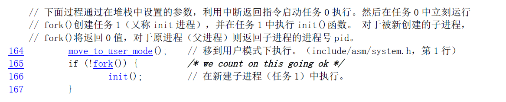这段代码在进程 0 中运行，先切换到用户模式，然后全系统第一次调用 `fork()` 建立进程 1。进程 1 调用 `init()`。在 `init()`中：这段代码建立了文件描述符 0、1 和 2，它们分别就是 `stdin`、`stdout` 和 `stderr`。这三者的值是系统标准。可以把 log 文件的描述符关联到 3。文件系统初始化，描述符 0、1 和 2 关联之后，才能打开 log 文件，开始记录进程的运行轨迹。为了能尽早访问 log 文件，我们要让上述工作在进程 0 中就完成。所以把这一段代码从 `init()` 移动到 `main()` 中，放在 `move_to_user_mode()` 之后（不能再靠前了，前面的是内核态的空间），同时加上打开 log 文件的代码。修改的代码如下：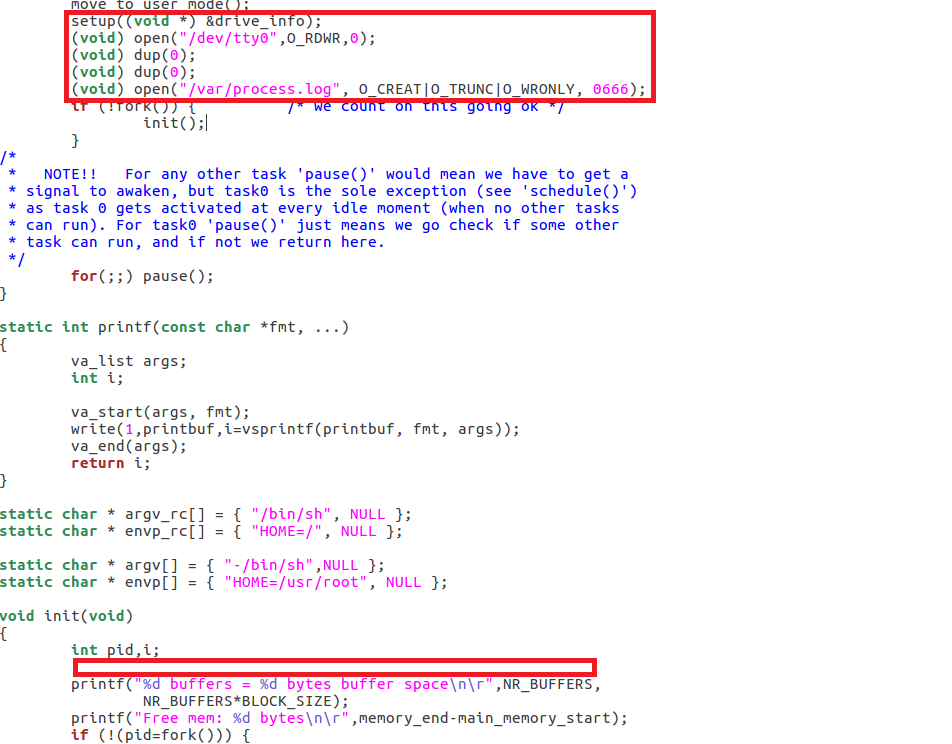其中我们添加的一句代码是`(void) open("/var/process.log",O_CREAT|O_TRUNC|O_WRONLY,0666)`其中`O_WRONLY` → 以写入模式打开,`O_CREAT` → 如果文件不存在，创建它,`O_TRUNC` → 如果文件已存在，清空它。`0666`表示所用用户都能对其读写。这样，文件描述符 0、1、2 和 3 就在进程 0 中建立了。根据 fork() 的原理，进程 1 会继承这些文件描述符，所以 `init()` 中就不必再 `open()` 它们。此后所有新建的进程都是进程 1 的子孙，也会继承它们。但实际上，`init()` 的后续代码和 `/bin/sh` 都会重新初始化它们。所以只有进程 0 和进程 1 的文件描述符肯定关联着 log 文件，这一点在接下来的写 log 中很重要。所以我们实现子进程的代码中也要尽量避免对关联文件的初始化等操作。

##### 2.添加fprintk

log 文件将被用来记录进程的状态转移轨迹。所有的状态转移都是在内核进行的。在内核状态下，`write()` 功能失效，其原理等同于《系统调用》实验中不能在内核状态调用 `printf()`，只能调用 `printk()`。编写可在内核调用的 `write()` 的难度较大，所以这里直接给出源码。它主要参考了 `printk()` 和 `sys_write()` 而写成的：
```c
#include <linux/sched.h>
#include <sys/stat.h>

static char logbuf[1024];
int fprintk(int fd, const char *fmt, ...)
{
    va_list args;
    int count;
    struct file * file;
    struct m_inode * inode;

    va_start(args, fmt);
    count=vsprintf(logbuf, fmt, args);
    va_end(args);
/* 如果输出到stdout或stderr，直接调用sys_write即可 */
    if (fd < 3)
    {
        __asm__("push %%fs\n\t"
            "push %%ds\n\t"
            "pop %%fs\n\t"
            "pushl %0\n\t"
            "pushl $logbuf\n\t"
            "pushl %1\n\t"
            "call sys_write\n\t"
            "addl $8,%%esp\n\t"
            "popl %0\n\t"
            "pop %%fs"
            ::"r" (count),"r" (fd):"ax","cx","dx");
    }
    else
/* 假定>=3的描述符都与文件关联。事实上，还存在很多其它情况，这里并没有考虑。*/
    {
    /* 从进程0的文件描述符表中得到文件句柄 */
        if (!(file=task[0]->filp[fd]))
            return 0;
        inode=file->f_inode;

        __asm__("push %%fs\n\t"
            "push %%ds\n\t"
            "pop %%fs\n\t"
            "pushl %0\n\t"
            "pushl $logbuf\n\t"
            "pushl %1\n\t"
            "pushl %2\n\t"
            "call file_write\n\t"
            "addl $12,%%esp\n\t"
            "popl %0\n\t"
            "pop %%fs"
            ::"r" (count),"r" (file),"r" (inode):"ax","cx","dx");
    }
    return count;
}
```
因为和 `printk` 的功能近似，建议将此函数放入到 `kernel/printk.c` 中。`fprintk()` 的使用方式类同与 C 标准库函数 `fprintf()`，唯一的区别是第一个参数是文件描述符，而不是文件指针。

##### 3.修改fork.c

必须找到所有发生进程状态切换的代码点，并在这些点添加适当的代码，来输出进程状态变化的情况到 log 文件中。此处要面对的情况比较复杂，需要对 `kernel` 下的 `fork.c`、`sched.c` 有了解，而 `exit.c`也会涉及到。这里我们首先从`fork.c`下手，因为其是一个进程的起点，在课程中我们学习到，*fork*会复制父程序的所有状态生成子程序，接着会将子程序置为就绪态放入就绪队列等待调度，所以在这个过程中会涉及到两个过程*N(新建) -> J(就绪)*故而我们要找到子程序的新建和及调度，那么：*一个进程的新建是从那里开始的呢？*这里我们需要阅读`fork`的源代码得知。首先让我们缕一缕`fork`调用的过程：
```
用户程序调用 fork()
    ↓
系统调用进入内核（int 0x80）
    ↓
sys_fork() 被调用
    ↓
find_empty_process() 寻找空闲任务槽
    ↓
copy_process() 创建新进程
    ├── 分配task_struct内存
    ├── 复制父进程结构
    ├── 初始化子进程属性
    ├── 设置TSS（任务状态段）
    ├── copy_mem() 复制内存空间
    │   └── copy_page_tables() 复制页表（写时复制）
    ├── 复制文件描述符
    ├── 设置进程关系链表
    ├── 设置GDT中的描述符
    └── 设置状态为TASK_RUNNING
    ↓
返回子进程PID（父进程）或0（子进程）
```
`fork`主要的功能实现在`copy_process`如果严格的讲新进程的出现在其被分配`task_struct`内存就在物理意义上出现了出现，从状态机角度:在该函数里有这么一句函数`p->state = TASK_UNINTERRUPTIBLE`，因为这时进程有了第一个有效状态,从用户感知角度：从这一句函数`p->state = TASK_RUNNING`开始，因为这时进程才能真正运行,我感觉这三者都有正确性在这里,我选择将设置状态为`TASK_RUNNING`之前设置为进程的新建,而其后设置为进程的就绪故而: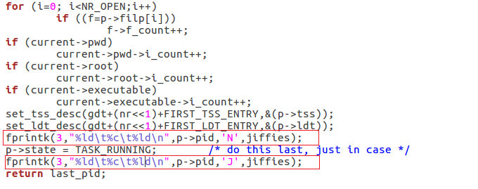在这里让我们分析一下`copy_process`的整个代码,为什么它会在设置子进程为可运行的之前要设置其为不可中断的睡眠?以及该函数对进程关系的维护.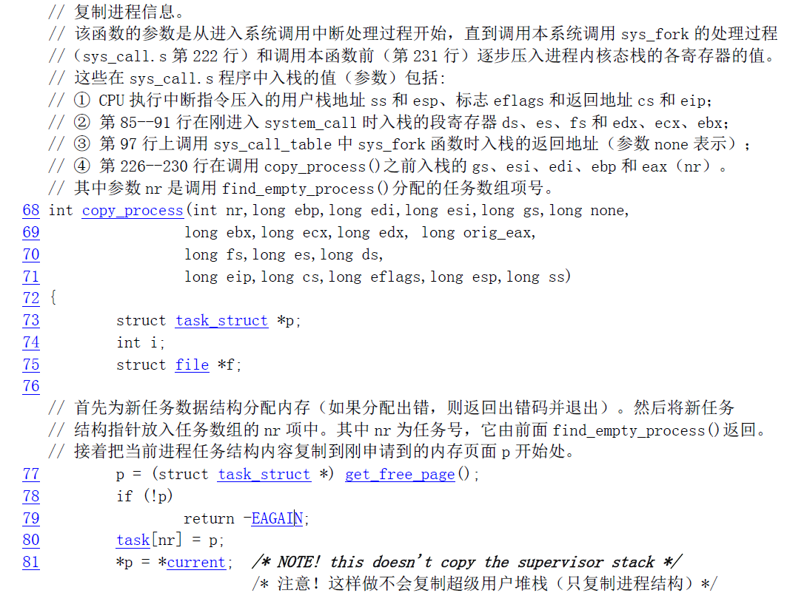在进程出生的初始必定是为其分发一个空间并且将其归类到正确的位置`task`数组中,这个数组储存的是系统中所有进程的PCB指针(包括僵尸进程)，而且在`Linux 0.11`中其大小只有*64*,这也就说明了如果我们不及时回收僵尸进程那么系统的进程资源将很快耗尽,接着就是对新进程分配进程号以及设置其为`TASK_UNINTERRUPTIBLE`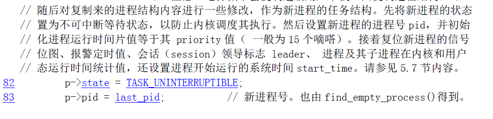
这是一种防御性编程在这里我们要弄明白一件事,究竟是谁在运行这段代码?*父进程*,当前代码是在父进程中运行的,我们对子进程的设置不会改变父进程运行的状态,此时设置其为不可中断的睡眠是为了防止在父进程复制自身给子进程时有信号激活子进程的运行,所以要在这是设置其状态不要其去处理任何信号,当我们将子进程的设置完全后就可以更改其状态为就绪态去等待调度运行了.当我们复制完父进程于子进程之后,再设置`GDT`表以及进程之间的关系最后将其再置为就绪态再返回,这样子进程就可以调度执行啦.

##### 4.修改sched.c

这是程序调度的主函数,在这里的程序除了新建和退出两种状态其余的状态都应该出现,我们需要寻找状态的转移点所寻找的就是再这个文件中出现的`(*p) -> state = ...`此类的代码其更改涉及很多:
```c
void schedule(void)
{
    int i,next,c;
    struct task_struct ** p;

    /* check alarm, wake up any interruptible tasks that have got a signal */

    for(p = &LAST_TASK ; p > &FIRST_TASK ; --p)
        if (*p) {
            if ((*p)->alarm && (*p)->alarm < jiffies) {
                (*p)->signal |= (1<<(SIGALRM-1));
                (*p)->alarm = 0;
            }
            if (((*p)->signal & ~(_BLOCKABLE & (*p)->blocked)) &&
                (*p)->state==TASK_INTERRUPTIBLE)
            {
                (*p)->state=TASK_RUNNING;
                /*可中断睡眠 => 就绪*/
                fprintk(3,"%ld\t%c\t%ld\n",(*p)->pid,'J',jiffies);
            }
        }

    /* this is the scheduler proper: */

    while (1) {
        c = -1;
        next = 0;
        i = NR_TASKS;
        p = &task[NR_TASKS];
        while (--i) {
            if (!*--p)
                continue;
            if ((*p)->state == TASK_RUNNING && (*p)->counter > c)
                c = (*p)->counter, next = i;
        }
        if (c) break;
        for(p = &LAST_TASK ; p > &FIRST_TASK ; --p)
            if (*p)
                (*p)->counter = ((*p)->counter >> 1) +
                (*p)->priority;
    }
    /*编号为next的进程 运行*/
    if(current->pid != task[next] ->pid)
    {
        /*时间片到时程序 => 就绪*/
        if(current->state == TASK_RUNNING)
            fprintk(3,"%ld\t%c\t%ld\n",current->pid,'J',jiffies);
        fprintk(3,"%ld\t%c\t%ld\n",task[next]->pid,'R',jiffies);
    }
    switch_to(next);
}

int sys_pause(void)
{
    current->state = TASK_INTERRUPTIBLE;
    /*
    *当前进程  运行 => 可中断睡眠
    */
    if(current->pid != 0)
        fprintk(3,"%ld\t%c\t%ld\n",current->pid,'W',jiffies);
    schedule();
    return 0;
}

void sleep_on(struct task_struct **p)
{
    struct task_struct *tmp;

    if (!p)
        return;
    if (current == &(init_task.task))
        panic("task[0] trying to sleep");
    tmp = *p;
    *p = current;
    current->state = TASK_UNINTERRUPTIBLE;
    /*
    *当前进程进程 => 不可中断睡眠
    */
    fprintk(3,"%ld\t%c\t%ld\n",current->pid,'W',jiffies);
    schedule();
    if (tmp)
    {
        tmp->state=0;
        /*
        *原等待队列 第一个进程 => 唤醒（就绪）
        */
        fprintk(3,"%ld\t%c\t%ld\n",tmp->pid,'J',jiffies);
    }
}

void interruptible_sleep_on(struct task_struct **p)
{
    struct task_struct *tmp;

    if (!p)
        return;
    if (current == &(init_task.task))
        panic("task[0] trying to sleep");
    tmp=*p;
    *p=current;
repeat: current->state = TASK_INTERRUPTIBLE;
    /*
    *这一部分属于 唤醒队列中间进程，通过goto实现唤醒 队列头进程 过程中Wait
    */
    fprintk(3,"%ld\t%c\t%ld\n",current->pid,'W',jiffies);
    schedule();
    if (*p && *p != current) {
        (**p).state=0;
        /*
        *当前进程进程 => 可中断睡眠 同上
        */
        fprintk(3,"%ld\t%c\t%ld\n",(*p)->pid,'J',jiffies);
        goto repeat;
    }
    *p=NULL;
    if (tmp)
    {
        tmp->state=0;
        /*
        *原等待队列 第一个进程 => 唤醒（就绪）
        */
        fprintk(3,"%ld\t%c\t%ld\n",tmp->pid,'J',jiffies);
    }
}

void wake_up(struct task_struct **p)
{
    if (p && *p) {
        (**p).state=0;
        /*
        *唤醒 最后进入等待序列的 进程
        */
        fprintk(3,"%ld\t%c\t%ld\n",(*p)->pid,'J',jiffies);
        *p=NULL;
    }
}
```
这部分代码,特别是`sleep`部分的代码存在一定的问题,我个人是很难理解其调度唤醒的策略.`sys_pause`在`Linux0.11`中，`sys_pause()`系统调用的主要作用是让进程暂停执行，直到接收到一个信号。当进程调用`sys_pause()`系统调用时，它会将自己的状态设置为`TASK_INTERRUPTIBLE`，并且将其添加到等待信号队列中。然后，进程会进入睡眠状态，直到收到一个信号或者被其他进程显式地唤醒。 这个系统调用通常用于实现等待信号的操作，比如等待一个定时器信号或者等待一个IO操作完成的信号。在这种情况下，进程可以使用`sys_pause()`系统调用进入睡眠状态，而不必浪费CPU资源等待信号的到来。当信号到来时，内核会唤醒进程，并且将信号传递给进程的信号处理程序进行处理。

##### 3.修改exit.c

```c
int do_exit(long code)
{

    int i;
    free_page_tables(get_base(current->ldt[1]),get_limit(0x0f));
    free_page_tables(get_base(current->ldt[2]),get_limit(0x17));
    for (i=0 ; i<NR_TASKS ; i++)
        if (task[i] && task[i]->father == current->pid) {
            task[i]->father = 1;
            if (task[i]->state == TASK_ZOMBIE)
                /* assumption task[1] is always init */
                (void) send_sig(SIGCHLD, task[1], 1);
        }
    for (i=0 ; i<NR_OPEN ; i++)
        if (current->filp[i])
            sys_close(i);
    iput(current->pwd);
    current->pwd=NULL;
    iput(current->root);
    current->root=NULL;
    iput(current->executable);
    current->executable=NULL;
    if (current->leader && current->tty >= 0)
        tty_table[current->tty].pgrp = 0;
    if (last_task_used_math == current)
        last_task_used_math = NULL;
    if (current->leader)
        kill_session();
    current->state = TASK_ZOMBIE;
    current->exit_code = code;
    fprintk(3,"%ld\t%c\t%ld\n",current->pid,'E',jiffies);
    tell_father(current->father);
    schedule();
    return (-1);    /* just to suppress warnings */
}
```

##### 4.生成log文件
将我们编写的`process.c`通过文件上载上传到`Linux 0.11`这个小系统中并编译运行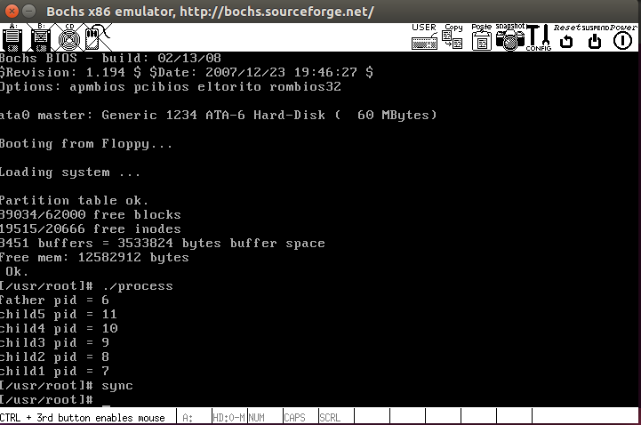将生成的`process.log移动到虚拟机下`
```bash
sudo ./mount-hdc
cp hdc/var/process.log process.log
```
可得到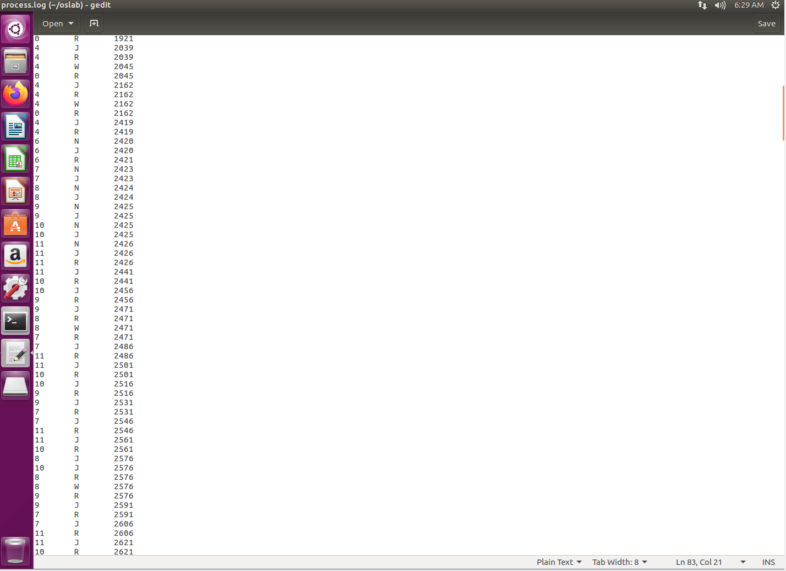通常情况下得到的 `process.log` 文件的前几行是:
```
1    N    48    //进程1新建（init()）。此前是进程0建立和运行，但为什么没出现在log文件里？
1    J    49    //新建后进入就绪队列
0    J    49    //进程0从运行->就绪，让出CPU
1    R    49    //进程1运行
2    N    49    //进程1建立进程2。2会运行/etc/rc脚本，然后退出
2    J    49
1    W    49    //进程1开始等待（等待进程2退出）
2    R    49    //进程2运行
3    N    64    //进程2建立进程3。3是/bin/sh建立的运行脚本的子进程
3    J    64
2    E    68    //进程2不等进程3退出，就先走一步了
1    J    68    //进程1此前在等待进程2退出，被阻塞。进程2退出后，重新进入就绪队列
1    R    68
4    N    69    //进程1建立进程4，即shell
4    J    69
1    W    69    //进程1等待shell退出（除非执行exit命令，否则shell不会退出）
3    R    69    //进程3开始运行
3    W    75
4    R    75
5    N    107    //进程5是shell建立的不知道做什么的进程
5    J    108
4    W    108
5    R    108
4    J    110
5    E    111    //进程5很快退出
4    R    111
4    W    116    //shell等待用户输入命令。
0    R    116    //因为无事可做，所以进程0重出江湖
4    J    239    //用户输入命令了，唤醒了shell
4    R    239
4    W    240
0    R    240
……
```
##### 5. 分析log
用指导书给的py脚本程序`stat_log.py`分析log文件，在分析之前将py脚本文件的第一行`#!/usr/bin/python`改为#`!/usr/bin/python2`（已安装python2）以适配版本，否则在python3环境下print函数会出错 为该脚本文件分配可执行权限`chmod +x stat_log.py`执行脚本，分析进程7、8、9、10、11的运行情况（多个指标：平均周转时间，平均等待时间）`./stat_log.py process.log 7 8 9 10 11 -g | less`结构如图: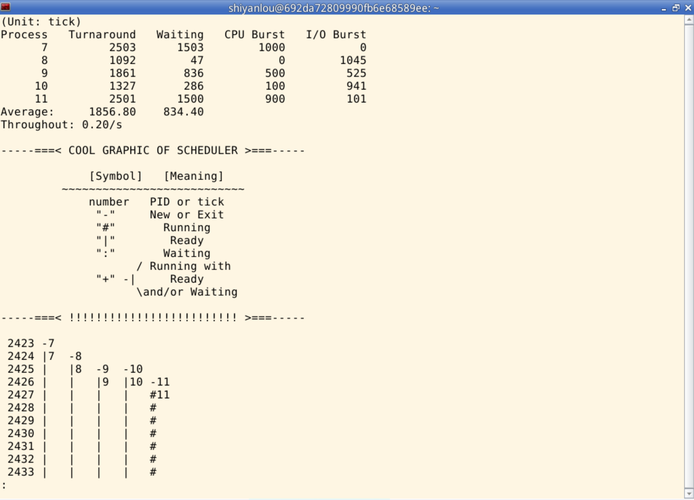

##### 6. 修改时间片，重新分析log
进程的时间片是进程的*counter*值，而*counter*在*schedule*函数中根据*priority*动态设置，因此进程的时间片受*counter*和*prioriy*两个变量的影响。进程的*priority*继承自父进程，进而所有进程的*priority*都来自于进程0 。 `linux0.11`中，*priority*和*counter*在`include/linux/sched.h`中定义: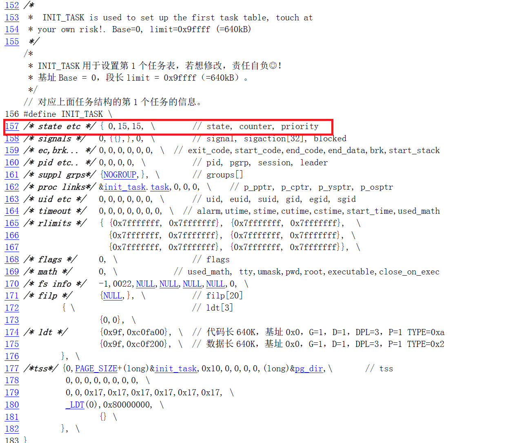我们修改这个值，然后重新执行process程序，分析log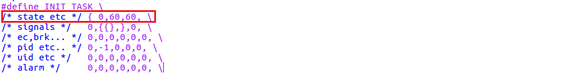修改后如下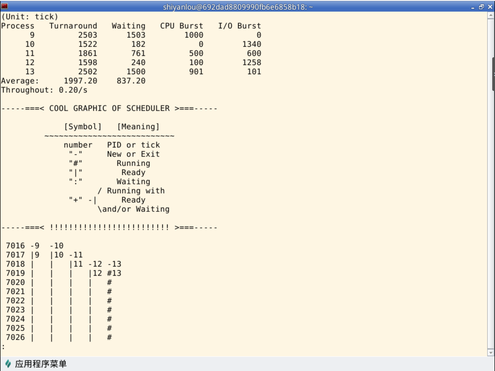

- 当进程的执行时间很长时，增加时间片大小可能会导致进程在等待时间片结束时的等待时间变长，因为进程需要等待更长的时间才能获得 CPU
- 当进程的数量非常多时，增加时间片大小可能会导致进程在就绪队列中等待的时间变长，因为每个进程需要等待更长的时间才能获得 CPU。
因此，时间片大小的设置需要根据具体情况进行调整，不能简单地认为增加时间片大小一定会减少平均周转时间。需要根据系统中进程的数量、执行时间等因素来选择合适的时间片大小，从而达到更好的系统性能。至此,试验结束.